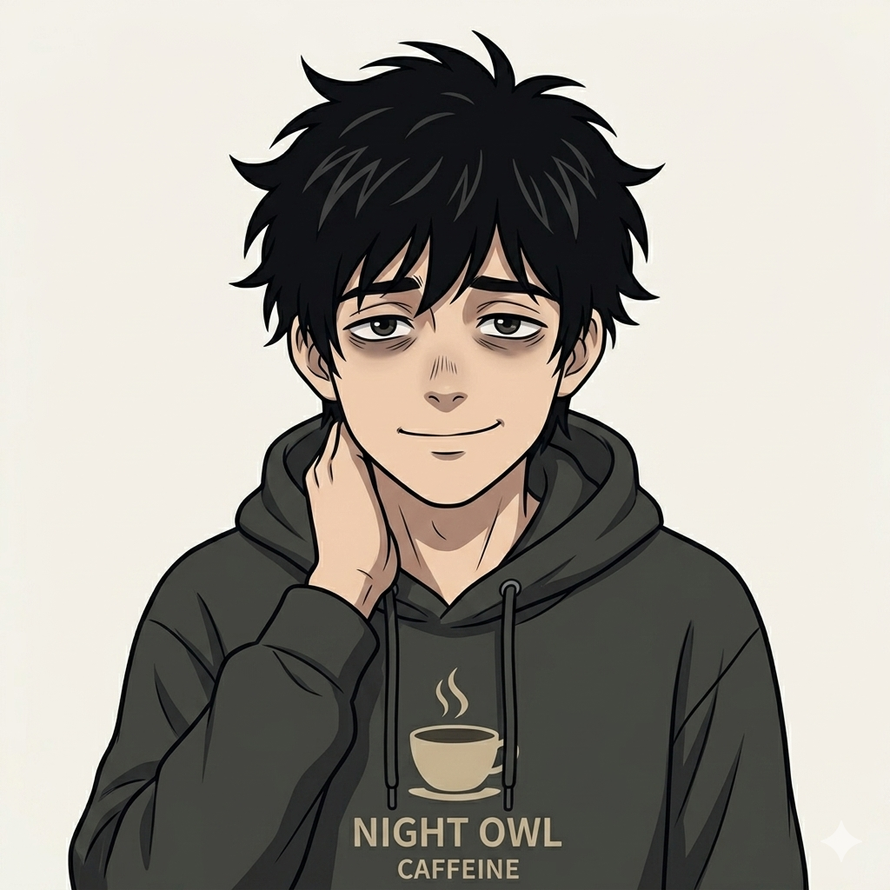
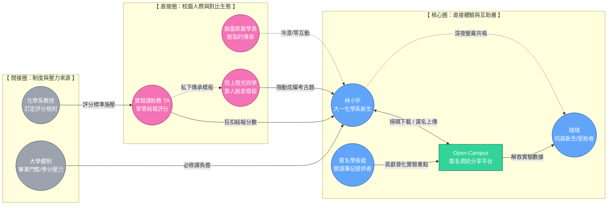
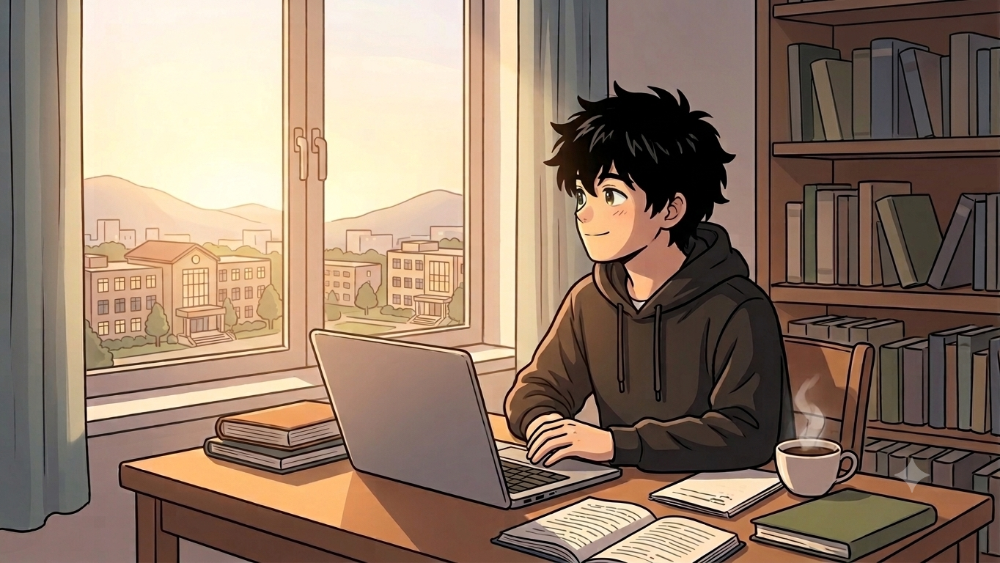
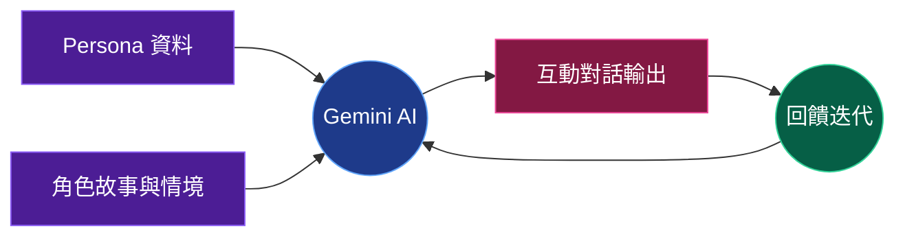
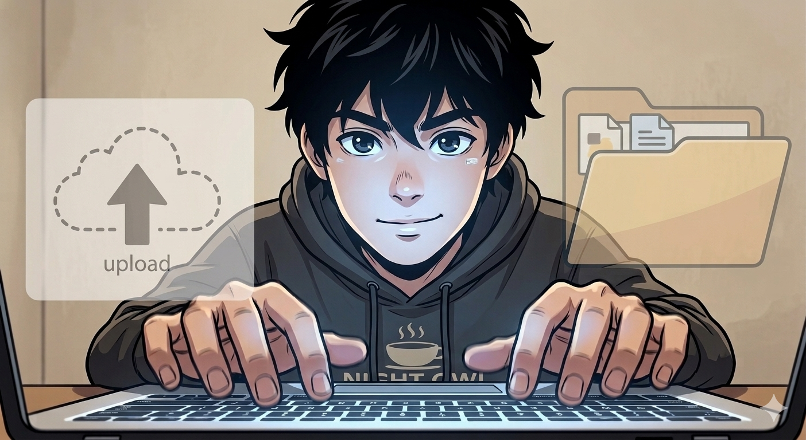
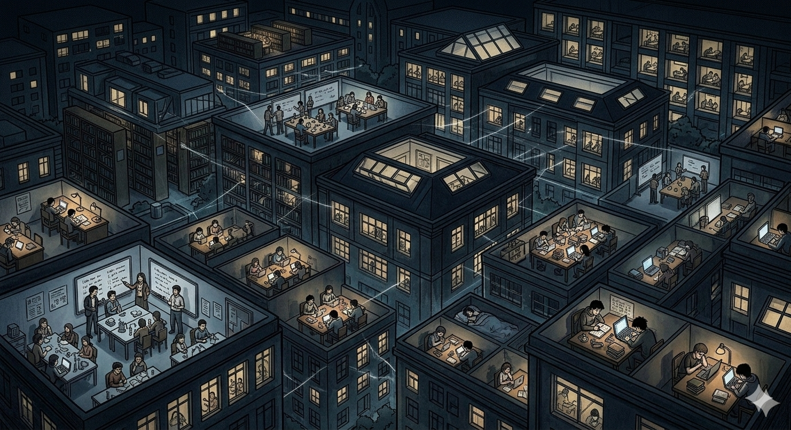

  

    <AuraPill status="active" class="mb-8 text-white">Initialize Presentation</AuraPill>
    <h1 class="text-8xl font-black tracking-tighter mb-4 leading-[0.9] uppercase">
      Break the 
      Bubble.
    </h1>
    

      大學裡的成績競爭，往往不是「努力程度」的競爭，而是「人脈與資訊」的競爭。
    

    <AuraStatus class="text-white opacity-60">Version 1.0.7 // Design_Thinking_Phase_Focus</AuraStatus> 
    

      Designers: 郭彥均 / 吳柏宏 / 徐愉皓 / 洪楷傑
    

  

<AuraGlobe />

---

  <AuraPill status="info" class="mb-4">Phase 1: Empathize & Define</AuraPill>
  <h1 class="text-6xl font-semibold tracking-tighter mb-6 uppercase text-left flex items-center gap-4">
    <i class="i-carbon:brain-circuit text-blue-400"></i> Team Brainstorming
  </h1>
  

    <AuraCard v-for="m in [
      { name: '郭彥均', major: '化學系', title: '破碎資源與低投報勞動', desc: '實驗課僅 1 學分，卻需耗費 6+ 小時抄寫結預報。資源破碎不共享，努力在繁瑣勞動中被磨損。', color: 'text-blue-400', border: 'hover:border-blue-400/40' },
      { name: '吳柏宏', major: '化工系', title: '量多質重複的窒息感', desc: '必修與選修內容高度重疊。在 AI 時代仍被迫背誦瑣碎知識，缺乏實作導向的優化學習路徑。', color: 'text-emerald-400', border: 'hover:border-emerald-400/40' },
      { name: '徐愉皓', major: '機械系', title: '同儕競爭與知識工具化', desc: '必修比例過高導致學習淪為應付考試。資源分配不均，理論與實作斷裂，學了卻不知道怎麼用。', color: 'text-amber-400', border: 'hover:border-amber-400/40' },
      { name: '洪楷傑', major: '生科系', title: '人脈即分數的壟斷', desc: '有無考古題極大影響成績公平性。教授隱藏教材規則強迫聽課，卻讓沒人脈的學生陷入迷失。', color: 'text-pink-400', border: 'hover:border-pink-400/40' }
    ]" :key="m.name" class="p-8 transition-all hover:bg-white/10 hover:-translate-y-1" :class="m.border">
      

        
{{ m.name }} // {{ m.major }}

      

      

        <i class="i-carbon:tag text-xs text-slate-500"></i> {{ m.title }}
      

      
{{ m.desc }}

    </AuraCard>
  

---

  <AuraPill status="info" class="mb-8">Phase 1: Empathize & Define</AuraPill>
  <h1 class="text-7xl font-semibold tracking-tighter mb-6 leading-tight uppercase text-white">Issue Summary</h1>
  

    問題根源：高教制度與社會期待的錯位，導致學生承擔了結構性的「隱形勞動」。
  

  

    

      

        

          

          

            
資源門檻化

            
人脈與資訊差取代了努力的價值。

          

        

        

          

          

            
時間貧窮

            
高強度課後負擔侵蝕了學生的自主權。

          

        

        

          

          

            
孤島效應

            
缺乏人脈支持的同學淪為資訊邊緣人。

          

        

      

    

    

      <SystemLog :logs="[
        { time: 'INSIGHT', msg: '學生渴望的是「公平競爭的安心感」。' },
        { time: 'AI_CO_PILOT', msg: '運用 Gemini 分析逐字稿，抓出深層痛點。' },
        { time: 'HMW', msg: '如何建立去中心化機制，打破人際圈壁壘？' }
      ]" />
    

  

---

  

    

      

        {{ name }}
      

    

    

      

      
Synthesizing Data Points

    

    <AuraFrame class="px-20 py-8 bg-black/60 shadow-[0_0_50px_rgba(59,130,246,0.1)] border-blue-400/20 rounded-xl backdrop-blur-md">
      

        <AuraStatus class="mb-2 text-white font-mono opacity-80">Virtual Persona Synthesized</AuraStatus>
        
林小宇

        
Student Persona Alpha

      

    </AuraFrame>
  

---

  <AuraPill status="info" class="mb-8">Phase 1: Empathize & Define</AuraPill>
  <h1 class="text-6xl font-semibold tracking-tighter mb-6 leading-tight uppercase text-white">Persona Context</h1>
  

    

      

        林小宇抽到了不回訊息的「幽靈直屬」，面對 1 學分卻需耗費 6 小時的實驗課，他必須獨自查閱繁雜的 MSDS 資訊並手寫預報。
      

      

        

          
The Frustration

          

            "按部就班每一步都很合理，卻摸不透教授隱藏的扣分標準，總是得不到應有的分數。"
          

        

        

          
The Gap

          

            "同班那些跟學長姐混得很熟的同學，拿著內線考古題與模板提早交卷，去慶祝勝利。"
          

        

      

    

    

      <AuraFrame class="aspect-[4/3] flex items-center justify-center bg-black/80 overflow-hidden relative group border-white/5">
         
         

         

      </AuraFrame>
      <SystemLog :logs="[
        { time: 'ROLE', msg: '化學系新生 // 資訊孤島' },
        { time: 'STATUS', msg: '在深夜的圖書館發出沒人回答的訊號' }
      ]" />
    

  

---

  <AuraPill status="info" class="mb-8">Phase 1: Empathy & Define</AuraPill>
  <h1 class="text-6xl font-semibold tracking-tighter mb-12 uppercase text-white">Stakeholder Map</h1>
  

  

  

  

---

  <AuraPill status="info" class="mb-8">Phase 2: Ideate</AuraPill>
  
  

    

      <h1 class="text-6xl font-semibold tracking-tighter mb-4 uppercase text-white">Jobs To Be Done</h1>
      
我們如何讓努力重回應有的價值？

    

    

      <AuraCard v-for="(job, i) in [
        { type: '功能需求', goal: '快速獲取精華重點、避開重複摸索的無效工時。' },
        { type: '功能需求', goal: '獲取教授隱藏的扣分標準與歷年實驗地雷。' },
        { type: '情感需求', goal: '不再感到被制度排擠，降低對未來不確定性的焦慮。' },
        { type: '情感需求', goal: '獲得公平競爭的安心感與努力方向的確定感。' }
      ]" :key="i" class="p-6">
        

          {{ job.type }}
        

        
{{ job.goal }}

      </AuraCard>
    

  

---

  <AuraPill status="info" class="mb-8">Phase 2: Ideate</AuraPill>
  <AuraCard class="p-12 max-w-4xl border-blue-400/30 bg-blue-400/5">
    
How Might We

    <h2 class="text-6xl font-semibold leading-[1.1] tracking-tighter">
      我們如何建立一個 
      去中心化的校園知識共享機制， 
      打破人際圈的壁壘？
    </h2>
  </AuraCard>

---

  <AuraPill status="warning" class="mb-8">Phase 3: Prototype & Test</AuraPill>
  
  

    

      <h1 class="text-7xl font-semibold tracking-tighter mb-8 uppercase text-white leading-[0.85]">The Story</h1>
      

        「從一座注定被淹沒的孤島，到發現彼此連結的星網。」
      

      

        

          

          {{ item }}
        

      

    

    

      <AuraFrame class="p-0 overflow-hidden bg-black/60 aspect-video flex items-center justify-center border-white/5">
        
      </AuraFrame>
      <SystemLog v-click :logs="[
        { time: 'EVENT_01', msg: '晴晴上傳了防呆筆記。' },
        { time: 'EVENT_02', msg: '林小宇掃描了匿名分享傳送門。' },
        { time: 'EVENT_03', msg: '下載檔案：化學實驗重點筆記.pdf' },
        { time: 'FEEDBACK', msg: '林小宇：你的筆記救了我的實驗！😭' }
      ]" />
    

  

---

  <AuraPill status="warning" class="mb-8">Phase 3: Prototype & Test</AuraPill>
  <h1 class="text-6xl font-semibold tracking-tighter mb-6 uppercase text-white">Interview Flow</h1>
  

  

  

---

  <AuraPill status="warning" class="mb-8">Phase 3: Prototype & Test</AuraPill>
  <h1 class="text-6xl font-semibold tracking-tighter mb-8 uppercase text-white">Interview: Core Problem</h1>
  

    

      

        <h3 class="text-blue-400 font-semibold mb-2">核心洞察：資訊不對稱的剝奪感</h3>
        
林小宇面臨的最大痛苦並非課業本身，而是「努力被廉價化」。當他獨自花費 6 小時查閱 MSDS 時，現充同學僅靠「祖傳模板」即可輕鬆獲取 A+，這種結構性的不公平導致了強烈的孤立感與自我懷疑。

      

      

        <h3 class="text-pink-400 font-semibold mb-2">堅持的動力</h3>
        
支撐他堅持下去的並非熱情，而是「不甘心」。他不相信認真的人注定被淹沒，直到在走廊發現 QR Code，才第一次感受到被接住的溫度。

      

    

    

      

        

          

            
{{ chat.user }}

            

              {{ chat.msg }}
            

          

        

      

    

  

---

  <AuraPill status="warning" class="mb-8">Phase 3: Prototype & Test</AuraPill>
  <h1 class="text-6xl font-semibold tracking-tighter mb-4 uppercase text-white">Interview: Platform's Role</h1>
  

    

      

        <h3 class="text-blue-400 font-semibold mb-2">匿名性的關鍵意義</h3>
        
對林小宇而言，匿名是「保護衣」。實體讀書會對他來說是高壓的社交修羅場，而匿名平台則打破了人脈特權，讓他能在不需討好他人的情況下，安全地獲取知識並貢獻微光。

      

      

        <h3 class="text-pink-400 font-semibold mb-2">歸屬感的建立</h3>
        
平台不僅是工具，更是歸屬。當他收到其他同學「謝謝原 PO 救了我」的留言時，他第一次感受到自己不需要改變內向個性，也能在大學裡找到價值。

      

    

    

      

        

          

            
{{ chat.user }}

            

              {{ chat.msg }}
            

          

        

      

    

  

---

  <AuraPill status="warning" class="mb-8">Phase 3: Prototype & Test</AuraPill>
  <h1 class="text-6xl font-semibold tracking-tighter mb-4 uppercase text-white">Interview: Risks & Reality</h1>
  

    

      

        <h3 class="text-blue-400 font-semibold mb-2">分布式作弊網路的諷刺</h3>
        
實體直屬制度在現實中反而成了「分布式作弊網路」，每個人抄不同模板以分散風險。而集中式的匿名平台若被濫用，反而會因「答案趨同」而成為教授眼中的標靶。

      

      

        <h3 class="text-pink-400 font-semibold mb-2">無惡意的毀滅</h3>
        
「伸手黨巨嬰化」、「全班答案趨同」以及「過度推廣」，這些無惡意的行為往往才是毀滅互助生態系的最快路徑。平台必須培養「拿了火把，就要自己去探路」的文化。

      

    

    

      

        

          

            
{{ chat.user }}

            

              {{ chat.msg }}
            

          

        

      

    

  

---

  <AuraPill status="warning" class="mb-8">Phase 3: Prototype & Test</AuraPill>
  
  

    

      <h1 class="text-6xl font-semibold tracking-tighter mb-8 uppercase text-white leading-tight">Music: 《連上彼此》</h1>
      

        「原來這座孤島 終於連成了群，原來我從未真正 一個人 走過這場雨。」
      

    

    

      <AuraCard class="p-8 bg-black/40">
        <blockquote class="text-sm leading-loose m-0 text-white opacity-90">
          凌晨兩點的圖書館，螢幕亮著還沒關 
          一學分像一座山，壓得人快失去方向 
          有人早就拿到答案，而我還在反覆試算 
          努力是不是太廉價？孤單的人沒人回答
        </blockquote>
      </AuraCard>
    

  

---

  <AuraPill status="warning" class="mb-8">Phase 3: Prototype & Test</AuraPill>
  
  <h1 class="text-6xl font-semibold tracking-tighter mb-12 uppercase text-white border-b border-white/10 pb-4 text-left">Important Storyboards</h1>

  

    <AuraFrame class="p-0 overflow-hidden relative aspect-square bg-black/60 group border-white/10">
      
      
Scene_01: Library Abyss

    </AuraFrame>
    <AuraFrame class="p-0 overflow-hidden relative aspect-square bg-black/60 group border-white/10">
      
      
Scene_02: Portal Glow

    </AuraFrame>
    <AuraFrame class="p-0 overflow-hidden relative aspect-square bg-black/60 group border-white/10">
      
      
Scene_03: Archipelago

    </AuraFrame>
  

---

  <AuraPill status="warning" class="mb-8">Phase 3: Prototype & Test</AuraPill>
  <h1 class="text-6xl font-semibold tracking-tighter mb-12 uppercase text-white">Persona Verification</h1>
  

    <AuraCard class="p-6">
      
關於「匿名」的必要性

      
「如果平台需要實名，我絕對不敢點進去。匿名是我唯一的避風港，它讓我可以不用假裝堅強，單純地在深夜被別人的善意接住。」

    </AuraCard>
    <AuraCard class="p-6">
      
關於平台的隱憂

      
「如果大家都把這裡當作『抄答案』的新途徑，那我們的集體趨同只會引來教授的全面封殺。我們必須學會『保持獨立思考』。」

    </AuraCard>
  

---

  <AuraPill status="warning" class="mb-8">Phase 3: Prototype & Iteration</AuraPill>
  <h1 class="text-6xl font-semibold tracking-tighter mb-8 uppercase text-white">Pivot: The Rejected Idea</h1>
  
  

    <AuraCard class="p-8 border-l-4 border-l-red-500 bg-red-500/5">
      

        
 原型構想：實體讀書會
      

      

        我們最初假設：建立一個「In-Person Study Group（實體讀書會）」能解決學生的課業孤島問題，透過面對面交流傳承知識。
      

      

        Result: Rejected by Persona
      

    </AuraCard>
    

      
Persona Interview Feedback

      

        「對我這種內向又不太會社交的人，要主動走進一個實體的群體裡，心理壓力真的非常大。如果我在讀書會裡問了一個大家都懂的盲點，大家會不會覺得我很笨？」
      

      

        「在被平台『接住』之前，比起實體讀書會，我寧可選擇在深夜裡一個人當孤島。」
      

      

        
 結論：轉向去中心化的「匿名線上平台」
      

    

  

---

  <AuraPill status="active" class="mb-6 w-full">Phase 4: Delivery & Caring</AuraPill>
  
  

    <h1 class="text-6xl font-semibold tracking-tighter mb-8 uppercase text-white">Open-Campus Platform</h1>
    
我們不只是要做一個平台，而是要重建校園的「幸福傳承」。

  

  

    <AuraCard v-for="f in [
        { icon: 'i-carbon:send-alt', title: '匿名傳送門', desc: '打破私藏潛規則，透過 QR Code 讓筆記與趨勢成為真正自由流動的校園公共傳承。' },
        { icon: 'i-carbon:document-sentiment', title: '電子便利貼', desc: '「加油，你一定能撐過這學期」。透過匿名的溫暖留言，建立跨時空的互助情感連結。' },
        { icon: 'i-carbon:network-4', title: '星網效應', desc: '讓校園不再是零和競爭的叢林。認知到成績不完全代表個人價值，穩穩接住每一個無助靈魂。' }
      ]" :key="f.title" class="flex flex-col items-center p-8 transition-all hover:-translate-y-2 border-white/5 hover:border-blue-400/30">
        

          

        

        
{{ f.title }}

        
{{ f.desc }}

    </AuraCard>
  

---

  <AuraPill class="mb-8" status="active">Phase 4: Delivery & Caring</AuraPill>
  <h1 class="text-6xl font-semibold tracking-tighter mb-12 uppercase text-white">Happiness Practice Guide</h1>
  

    <AuraCard class="p-8 border-l-4 border-l-blue-400 bg-blue-400/5">
      
自我照護 (Self-Care)

      

        認清體制性的「資訊差」，減少對自我能力的質疑。我們不僅優化學習，更守護情緒。
      

    </AuraCard>
    <AuraCard class="p-8 border-l-4 border-l-pink-400 bg-pink-400/5">
      
支持他人 (Caring for Others)

      

        讓私有「秘笈」轉化為公共資產，讓邊緣人不再孤單，每個人的努力都能被看見。
      

    </AuraCard>
  

