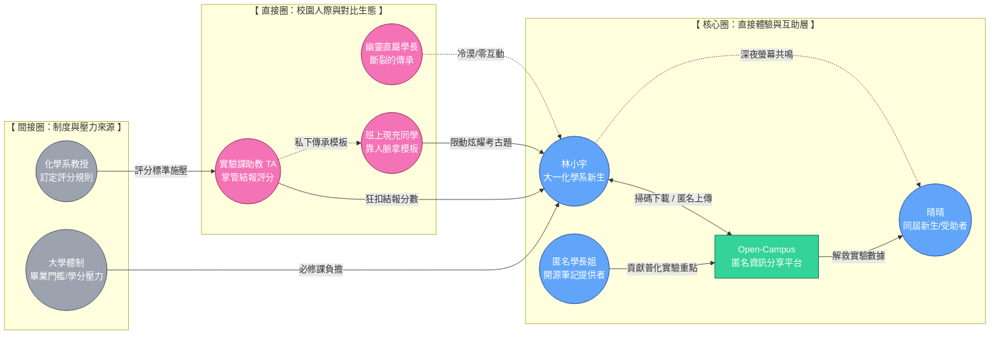
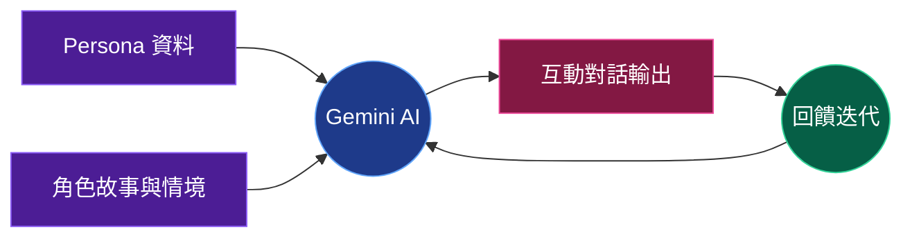
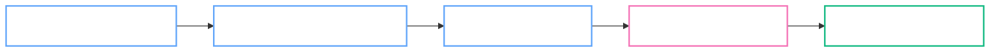

  

    <AuraPill status="active" class="mb-8 text-white">Initialize Presentation</AuraPill>
    <h1 class="text-8xl font-black tracking-tighter mb-4 leading-[0.9] text-white uppercase">
      Break the 
      Bubble.
    </h1>
    

      大學裡的成績競爭，往往不是「努力程度」的競爭，而是「人脈與資訊」的競爭。
    

    <AuraStatus class="text-white opacity-60">Version 1.0.7 // Design_Thinking_Phase_Focus</AuraStatus> 
    

      Designers: 郭彥均 / 吳柏宏 / 徐愉皓 / 洪楷傑
    

  

---

<!-- TODO: add more colors in theme -->

  <AuraPill status="info" class="mb-4">Phase 1: Empathize & Define</AuraPill>
  <h1 class="text-6xl font-black tracking-tighter mb-6 uppercase text-left flex items-center gap-4">
    <i class="i-carbon:brain-circuit text-blue-400"></i> Team Brainstorming
  </h1>
  

    <AuraCard v-for="m in [
      { name: '郭彥均', major: '化學系', title: '破碎資源與低投報勞動', desc: '實驗課僅 1 學分，卻需耗費 6+ 小時抄寫結預報。資源破碎不共享，努力在繁瑣勞動中被磨損。' },
      { name: '吳柏宏', major: '化工系', title: '量多質重複的窒息感', desc: '必修與選修內容高度重疊。在 AI 時代仍被迫背誦瑣碎知識，缺乏實作導向的優化學習路徑。' },
      { name: '徐愉皓', major: '機械系', title: '同儕競爭與知識工具化', desc: '必修比例過高導致學習淪為應付考試。資源分配不均，理論與實作斷裂，學了卻不知道怎麼用。' },
      { name: '洪楷傑', major: '生科系', title: '人脈即分數的壟斷', desc: '有無考古題極大影響成績公平性。教授隱藏教材規則強迫聽課，卻讓沒人脈的學生陷入迷失。' }
    ]" :key="m.name" class="p-8 transition-all hover:bg-white/10 hover:border-blue-400/40 hover:-translate-y-1">
      

        
{{ m.name }} // {{ m.major }}

      

      

        <i class="i-carbon:tag text-xs text-slate-500"></i> {{ m.title }}
      

      
{{ m.desc }}

    </AuraCard>
  

---

  <AuraPill status="info" class="mb-8">Phase 1: Empathize & Define</AuraPill>
  <h1 class="text-7xl font-semibold tracking-tighter mb-6 leading-tight uppercase text-white">Issue Summary</h1>
  

    問題根源：高教制度與社會期待的錯位，導致學生承擔了結構性的「隱形勞動」。
  

  

    

      

        

          

          

            
資源門檻化

            
人脈與資訊差取代了努力的價值。

          

        

        

          

          

            
時間貧窮

            
高強度課後負擔侵蝕了學生的自主權。

          

        

        

          

          

            
孤島效應

            
缺乏人脈支持的同學淪為資訊邊緣人。

          

        

      

    

    

      <SystemLog :logs="[
        { time: 'INSIGHT', msg: '學生渴望的是「公平競爭的安心感」。' },
        { time: 'AI_CO_PILOT', msg: '運用 Gemini 分析逐字稿，抓出深層痛點。' },
        { time: 'HMW', msg: '如何建立去中心化機制，打破人際圈壁壘？' }
      ]" />
    

  

---

  

    

      

        {{ name }}
      

    

    

      

      
Synthesizing Data Points

    

    <AuraFrame class="px-20 py-8 bg-black/60 shadow-[0_0_50px_rgba(59,130,246,0.1)] border-blue-400/20 rounded-xl backdrop-blur-md">
      

        <AuraStatus class="mb-2 text-white font-mono opacity-80">Virtual Persona Synthesized</AuraStatus>
        
林小宇

        
Student Persona Alpha

      

    </AuraFrame>
  

---

  <AuraPill status="info" class="mb-8">Phase 1: Empathize & Define</AuraPill>
  <h1 class="text-6xl font-black tracking-tighter mb-6 leading-tight uppercase text-white">Persona Context</h1>
  

    

      

        林小宇抽到了不回訊息的「幽靈直屬」，面對 1 學分卻需耗費 6 小時的實驗課，他必須獨自查閱繁雜的 MSDS 資訊並手寫預報。
      

      

        

          
The Frustration

          

            "按部就班每一步都很合理，卻摸不透教授隱藏的扣分標準，總是得不到應有的分數。"
          

        

        

          
The Gap

          

            "同班那些跟學長姐混得很熟的同學，拿著內線考古題與模板提早交卷，去慶祝勝利。"
          

        

      

    

    

      <AuraFrame class="aspect-[4/3] flex items-center justify-center bg-black/80 overflow-hidden relative group border-white/5">
         
         

         

      </AuraFrame>
      <SystemLog :logs="[
        { time: 'ROLE', msg: '化學系新生 // 資訊孤島' },
        { time: 'STATUS', msg: '在深夜的圖書館發出沒人回答的訊號' }
      ]" />
    

  

---

<!-- Stakeholder Map -->
<!-- Stakeholder Map -->

  <AuraPill status="info" class="mb-8">Phase 1: Empathy & Define</AuraPill>
  <h1 class="text-6xl font-black tracking-tighter mb-12 uppercase text-white">Stakeholder Map</h1>
  

  

  

---

  <AuraPill status="info" class="mb-8">Phase 2: Ideate</AuraPill>
  
  

    

      <h1 class="text-6xl font-black tracking-tighter mb-4 uppercase text-white">Jobs To Be Done</h1>
      
我們如何讓努力重回應有的價值？

    

    

      <AuraCard v-for="(job, i) in [
        { type: '功能需求', goal: '快速獲取精華重點、避開重複摸索的無效工時。' },
        { type: '功能需求', goal: '獲取教授隱藏的扣分標準與歷年實驗地雷。' },
        { type: '情感需求', goal: '不再感到被制度排擠，降低對未來不確定性的焦慮。' },
        { type: '情感需求', goal: '獲得公平競爭的安心感與努力方向的確定感。' }
      ]" :key="i" class="p-6">
        

          {{ job.type }}
        

        
{{ job.goal }}

      </AuraCard>
    

  

---

<!-- A redesign of the visualization is required here. -->

  <AuraPill status="info" class="mb-8">Phase 2: Ideate</AuraPill>
  <AuraCard class="p-12 max-w-4xl border-blue-400/30 bg-blue-400/5">
    
How Might We

    <h2 class="text-6xl font-bold leading-[1.1] tracking-tighter">
      我們如何建立一個 
      去中心化的校園知識共享機制， 
      打破人際圈的壁壘？
    </h2>
  </AuraCard>

---

<!-- Change the story to him using the resources from the platform. and only supply the notes when he got better. -->

<!-- The story iteration also requires a mermaid diagram. we first used our experiences to generate the persona. then we used gemini ai to generate the story. then we used gemini to generate the lyrics and suno ai to realize the music. the process of suno ai and gemini ai lyrics generation is iterative. -->

  <AuraPill status="warning" class="mb-8">Phase 3: Prototype & Test</AuraPill>
  
  

    

      <h1 class="text-7xl font-black tracking-tighter mb-8 uppercase text-white leading-[0.85]">The Story</h1>
      

        「從一座注定被淹沒的孤島，到發現彼此連結的星網。」
      

      

        

          

          {{ item }}
        

      

    

    

      <AuraFrame class="p-0 overflow-hidden bg-black/60 aspect-video flex items-center justify-center border-white/5">
        
      </AuraFrame>
      <SystemLog :logs="[
        { time: 'EVENT_01', msg: '林小宇掃描了匿名分享傳送門。' },
        { time: 'EVENT_02', msg: '下載檔案：化學實驗重點筆記.pdf' },
        { time: 'FEEDBACK', msg: '晴晴回覆：你的筆記救了我的實驗！😭' }
      ]" />
    

  

---

  <AuraPill status="info" class="mb-8">Phase 3: Prototype & Test</AuraPill>
  
  <h1 class="text-6xl font-black tracking-tighter mb-12 uppercase text-white border-b border-white/10 pb-4 text-left">Important Storyboards</h1>

  

    <AuraFrame class="p-0 overflow-hidden relative aspect-square bg-black/60 group border-white/10">
      
      
Scene_01: Library Abyss

    </AuraFrame>
    <AuraFrame class="p-0 overflow-hidden relative aspect-square bg-black/60 group border-white/10">
      
      
Scene_02: Portal Glow

    </AuraFrame>
    <AuraFrame class="p-0 overflow-hidden relative aspect-square bg-black/60 group border-white/10">
      
      
Scene_03: Archipelago

    </AuraFrame>
  

  

    // Checkpoint: Recording visual composition ideas & AI iteration process.
  

---

<!-- This should be integrated into the interview section. It feels disjointed as it is right now. -->

  <AuraPill status="warning" class="mb-8">Phase 3: Prototype & Test // Persona Verification</AuraPill>
  <h1 class="text-6xl font-black tracking-tighter mb-12 uppercase text-white">Interview</h1>
  

    <AuraCard class="p-6">
      
關於「匿名」的必要性

      
「如果平台需要實名，我絕對不敢點進去。匿名是我唯一的避風港，它讓我可以不用假裝堅強，單純地在深夜被別人的善意接住。」

    </AuraCard>
    <AuraCard class="p-6">
      
關於平台的隱憂

      
「如果大家都把這裡當作『抄答案』的新途徑，那我們的集體趨同只會引來教授的全面封殺。我們必須學會『保持獨立思考』。」

    </AuraCard>
  

---

<!-- Methodology Diagram -->

  <AuraPill status="info" class="mb-8">Research Methodology</AuraPill>
  <h1 class="text-6xl font-black tracking-tighter mb-6 uppercase text-white">Interaction Flow</h1>
  

  

  

  

---

<!-- FIXME: The chat is too fake. you should use the real data. -->

  <AuraPill status="warning" class="mb-8">Phase 3: Prototype & Test</AuraPill>
  <h1 class="text-6xl font-black tracking-tighter mb-8 uppercase text-white">Chat Record</h1>
  

    <!-- 1 -->
    

      
User

      
"你知道當初直屬制度安排一個學長姐的本意，與匿名平台的差異嗎？"

    

    

      
林小宇

      

        「直屬制度的本意是希望新生能有個溫暖依靠，透過革命情感薪火相傳。但它太依賴運氣，如果遇到『幽靈直屬』，線就斷了。匿名平台是為了接住這些被制度漏掉的靈魂。」
      

    

    <!-- 2 -->
    

      
User

      
"你覺得直屬制度是不是為了隱蔽集體抄襲的防彈衣？"

    

    

      
林小宇

      

        「這觀點太諷刺但也太真實了。實體直屬網絡變成了『分散式作弊系統』，每個模板都不同，教授很難抓。而平台集中化後，如果全班抄同份筆記，就是把脖子伸到刀口下。」
      

    

    <!-- 3 -->
    

      
User

      
"這聽起來很不樂觀，你覺得該怎麼辦？"

    

    

      
林小宇

      

        「我們得鼓勵『拿了火把，自己探路』的文化。平台只應提供地圖與指南，而非直接給答案。唯有保持獨立思考，我們才能在匿名的保護下，安全地存活在教授的雷達之外。」
      

    

  

---

<!-- FIXME: this should be part of the insights from the interview, the placeholder data should be swapped with the real one. -->

  <AuraPill status="warning" class="mb-8">Phase 3: Prototype & Test</AuraPill>
  
  <h1 class="text-6xl font-black tracking-tighter mb-12 uppercase text-white border-b border-white/10 pb-4">Pressure Test</h1>
  
  

    

      

        
01

        <AuraCard class="flex-1 py-4 border-l-4 border-l-blue-400">
          
Hoarding Senior

          
「我有大量資料，為什麼要分享？」

        </AuraCard>
      

      

        
02

        <AuraCard class="flex-1 py-4 border-l-4 border-l-blue-400">
          
Academic Integrity

          
教授擔心學生抄襲而非理解，防範惡意資訊。

        </AuraCard>
      

    

    

      <AuraCard class="p-8 border-pink-400/30 bg-pink-400/5 shadow-[0_0_30px_rgba(236,72,153,0.1)]">
        
Iteration_Result

        <h3 class="text-2xl font-black text-white mb-4 uppercase">開源審核機制</h3>
        

          加入「社群回報」與「開源審核」，確保資訊正確性。利用匿名便利貼的溫暖連結引發「傳承動力」，讓分享行為從利益驅動轉向情感驅動。
        

      </AuraCard>
    

  

---

<!-- Methodology -->

<!-- This should be moved to a previous section on the interview. -->

  <AuraPill status="info" class="mb-8">Methodology & Iteration</AuraPill>
  <h1 class="text-6xl font-black tracking-tighter mb-12 uppercase text-white">Methodology</h1>
  

    <AuraCard class="p-6">
      <h3 class="text-xl font-bold text-blue-400 mb-2">Persona-Driven Testing</h3>
      
透過與 AI 扮演的 Persona (林小宇) 進行深度訪談，我們挖掘出許多初期團隊未曾察覺的「無惡意破壞模式」，如集體抄襲造成的同質性風險。

    </AuraCard>
    <AuraCard class="p-6">
      <h3 class="text-xl font-bold text-pink-400 mb-2">Iterative Feedback Loop</h3>
      
我們將訪談結果迅速反饋至系統原型中，從單純的「資源下載」轉向強調「獨立思考與審核」的社群機制，提升平台永續性。

    </AuraCard>
  

  <AuraPill status="active" class="mb-12">Process Roadmap</AuraPill>
  
  

  

---

<!-- Add a section on how we failed to find 3 person for the iteration process so we used the persona interview data instead. Just add the stuff from the interview dialogue. -->

  <AuraPill status="info" class="mb-8">Phase 3: Prototype & Test</AuraPill>
  
  

    

      <h1 class="text-6xl font-black tracking-tighter mb-6 uppercase text-white">Student Response</h1>
      
對原型（Prototype）的真實反饋與洞察紀錄。

      

        

          "這正是我們需要的！看到有人願意匿名分享扣分標準，真的很有安全感。"
        

        

          "如果能確保資料不會過期或錯誤就更好了。"
        

      

    

    

      <AuraFrame class="w-full h-64 border border-dashed border-white/20 flex flex-col items-center justify-center text-slate-500 text-sm text-center p-8 bg-black/40 text-white">
        

        
[ 填寫區：訪談真實同學的回饋紀錄 ]

      </AuraFrame>
    

  

---

<!-- A detailed flowchart on the iteration process should be included. -->

  <AuraPill status="active" class="mb-8">Phase 4: Delivery & Caring</AuraPill>
  
  

    

      <h1 class="text-6xl font-black tracking-tighter mb-8 uppercase text-white leading-tight">Music: 《連上彼此》</h1>
      

        「原來這座孤島 終於連成了群，原來我從未真正 一個人 走過這場雨。」
      

      <!-- 

        <AuraPill variant="glass" status="active">▶ AUDIO_PLAYBACK_V3</AuraPill>
        <AuraPill variant="outline">VIEW_ITERATIONS</AuraPill>
      
 this is not implemented for now -->
    

    

      <AuraCard class="p-8 bg-black/40">
        <blockquote class="text-sm leading-loose m-0 border-none bg-transparent p-0 text-white opacity-90">
          凌晨兩點的圖書館，螢幕亮著還沒關 
          一學分像一座山，壓得人快失去方向 
          有人早就拿到答案，而我還在反覆試算 
          努力是不是太廉價？孤單的人沒人回答
        </blockquote>
      </AuraCard>
      
Gemini Lyrics & Suno Music

    

  

---

<!-- There's a massive problem here. we would frame it as that this platform is the iteration result. the orginal is actually a in-person study group. the persona should be found to reject the idea and only then do we think of the platform. -->

  <AuraPill status="active" class="mb-6 w-full">Phase 4: Delivery & Caring</AuraPill>
  
  

    <h1 class="text-6xl font-black tracking-tighter mb-8 uppercase text-white">Open-Campus Platform</h1>
    
我們不只是要做一個平台，而是要重建校園的「幸福傳承」。

  

  

    <AuraCard v-for="f in [
      { icon: 'i-carbon:send-alt', title: '匿名傳送門', desc: '打破私藏潛規則，透過 QR Code 讓筆記與趨勢成為真正自由流動的校園公共傳承。' },
      { icon: 'i-carbon:document-sentiment', title: '電子便利貼', desc: '「加油，你一定能撐過這學期」。透過匿名的溫暖留言，建立跨時空的互助情感連結。' },
      { icon: 'i-carbon:network-4', title: '星網效應', desc: '讓校園不再是零和競爭的叢林。認知到成績不完全代表個人價值，穩穩接住每一個無助靈魂。' }
    ]" :key="f.title" class="flex flex-col items-center p-8 transition-all hover:-translate-y-2 border-white/5 hover:border-blue-400/30">
      

        

      

      
{{ f.title }}

      
{{ f.desc }}

    </AuraCard>
  

---

<!-- A visual redesign is required here to make it aligned with the usual design -->

  <AuraPill class="mb-8" status="active">Phase 4: Delivery & Caring</AuraPill>

  <h1 class="text-6xl font-black tracking-tighter mb-12 uppercase text-white text-left">Happiness Practice Guide</h1>

  

    

      <AuraCard class="p-8 border-l-4 border-l-blue-400 bg-blue-400/5">
        
自我照護 (Self-Care)

        

          認知到成績不完全代表個人價值，有時候只是系統性的「資訊差」。  
          透過開發本專案，成員學習到如何調節「無法掌控結果」的焦慮，並確信問題根源於體制，減少對自我的質疑與自責。
        

      </AuraCard>
    

    

      <AuraCard class="p-8 border-l-4 border-l-pink-400 bg-pink-400/5">
        
支持他人 (Caring for Others)

        

          方案本質是「接住」那些沒有人脈網路支援的同學。透過匿名便利貼降低求助門檻。  
          讓校園中不再有資訊邊緣人，將私有的「秘笈」轉化為公共資產，讓每個發光的努力都能被彼此看見。
        

      </AuraCard>
    

  

