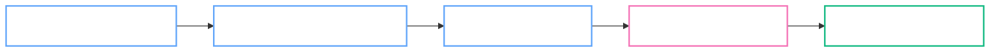

# slides.md

---

  

    <AuraPill status="active" class="mb-8 text-white">Initialize Presentation</AuraPill>
    <h1 class="text-8xl font-black tracking-tighter mb-4 leading-[0.9] text-white uppercase">
      Break the 
      Bubble.
    </h1>
    

      大學裡的成績競爭，往往不是「努力程度」的競爭，而是「人脈與資訊」的競爭。
    

    <AuraStatus class="text-white opacity-60">Version 1.0.6 // Design_Thinking_Final</AuraStatus>
  

---

  <AuraPill status="info" class="mb-8">Phase 1: Empathize & Define</AuraPill>
  <h1 class="text-6xl font-black tracking-tighter mb-12 uppercase text-white border-b border-white/10 pb-4 text-left">
    Team Brainstorming
  </h1>
  
  

    <AuraCard v-for="m in [
      { name: '郭彥均', major: '化學系', title: '破碎資源與低投報勞動', desc: '實驗課僅 1 學分，卻需耗費 6+ 小時抄寫 MSDS 預報，心理與投入極度不平衡。' },
      { name: '吳柏宏', major: '課程架構', title: '量多質重複的窒息感', desc: '必修與選修內容高度重疊，學生淪為瑣碎知識的背誦機器，而非培養高階判斷力。' },
      { name: '徐愉皓', major: '機械系', title: '同儕競爭與知識工具化', desc: '必修比例過高，學習淪為應付考試與獎學金排名，資源分配不均，實作與理論斷裂。' },
      { name: '洪楷傑', major: '資訊壁壘', title: '人脈即分數的壟斷', desc: '有無考古題極大影響成績公平性。教授隱藏教材規則強迫聽課，卻讓學生陷入混亂迷失。' }
    ]" :key="m.name" class="p-6">
      

        
{{ m.name }} / {{ m.major }}

        <AuraStatus v-if="m.name === '郭彥均'">Chem_Focus</AuraStatus>
      

      
{{ m.title }}

      
{{ m.desc }}

    </AuraCard>
  

---

  <AuraPill status="info" class="mb-8">Phase 1: Empathize & Define</AuraPill>
  
  

    

      <h1 class="text-7xl font-black tracking-tighter mb-6 leading-tight uppercase text-white">Issue Summary</h1>
      

        問題根源：高教制度與社會期待的錯位，導致學生承擔了結構性的「隱形勞動」。
      

      

        

          

          

            
資源門檻化

            
人脈與資訊差取代了努力的價值。

          

        

        

          

          

            
時間貧窮

            
高強度課後負擔侵蝕了學生的自主權。

          

        

        

          

          

            
孤島效應

            
缺乏人脈支持的同學淪為資訊邊緣人。

          

        

      

    

    

      <SystemLog :logs="[
        { time: 'INSIGHT', msg: '學生渴望的是「公平競爭的安心感」。' },
        { time: 'AI_CO_PILOT', msg: '運用 Gemini 分析逐字稿，抓出深層痛點。' },
        { time: 'HMW', msg: '如何建立去中心化機制，打破人際圈壁壘？' }
      ]" />
    

  

---

  <AuraPill status="info" class="mb-12">Phase 1: Empathize & Define</AuraPill>

  

    

      

        {{ name }}
      

    

    

      

      
Synthesizing Data Points

    

    <AuraFrame class="px-20 py-8 bg-black/60 shadow-[0_0_50px_rgba(59,130,246,0.1)] border-blue-400/20">
      

        <AuraStatus class="mb-2 text-white">Virtual Persona Synthesized</AuraStatus>
        
林小宇

        
Student Persona Alpha

      

    </AuraFrame>
  

---

  <AuraPill status="info" class="mb-8">Phase 1: Empathize & Define</AuraPill>
  
  

    

      <h1 class="text-6xl font-black tracking-tighter mb-6 leading-tight uppercase text-white">Persona Context</h1>
      

        林小宇抽到了不回訊息的「幽靈直屬」，面對 1 學分卻需耗費 6 小時的實驗課，他必須獨自查閱繁雜的 MSDS 資訊並手寫預報。
      

      

        

          
The Frustration

          

            "按部就班每一步都很合理，卻摸不透教授隱藏的扣分標準，總是得不到應有的分數。"
          

        

        

          
The Gap

          

            "同班那些跟學長姐混得很熟的同學，拿著內線考古題與模板提早交卷，去慶祝勝利。"
          

        

      

    

    

      <AuraFrame class="aspect-[4/3] flex items-center justify-center bg-black/80 overflow-hidden relative group border-white/5">
         
         

            
林小宇 (18歲)

         

      </AuraFrame>
      <SystemLog :logs="[
        { time: 'ROLE', msg: '化學系新生 // 資訊孤島' },
        { time: 'STATUS', msg: '在深夜的圖書館發出沒人回答的訊號' }
      ]" />
    

  

---

  <AuraPill status="info" class="mb-8">Phase 2: Ideate</AuraPill>
  
  

    

      <h1 class="text-6xl font-black tracking-tighter mb-4 uppercase text-white">Jobs To Be Done</h1>
      
我們如何讓努力重回應有的價值？

    

    

      <AuraCard v-for="(job, i) in [
        { type: '功能需求', goal: '快速獲取精華重點、避開重複摸索的無效工時。' },
        { type: '功能需求', goal: '獲取教授隱藏的扣分標準與歷年實驗地雷。' },
        { type: '情感需求', goal: '不再感到被制度排擠，降低對未來不確定性的焦慮。' },
        { type: '情感需求', goal: '獲得公平競爭的安心感與努力方向的確定感。' }
      ]" :key="i" class="p-6">
        

          {{ job.type }}
        

        
{{ job.goal }}

      </AuraCard>
    

  

---

  <AuraPill status="info" class="mb-8">Phase 2: Ideate // Summary</AuraPill>
  <AuraCard class="p-12 max-w-4xl border-blue-400/30 bg-blue-400/5">
    
How Might We Challenge

    <h2 class="text-5xl font-black italic text-white leading-[1.1] uppercase tracking-tighter">
      我們如何建立一個 
      去中心化的校園知識共享機制， 
      打破人際圈的壁壘？
    </h2>
  </AuraCard>

---

  <AuraPill status="warning" class="mb-8">Phase 3: Prototype & Test</AuraPill>
  
  

    

      <h1 class="text-8xl font-black tracking-tighter mb-8 uppercase text-white leading-[0.85]">The Story.</h1>
      

        「從一座注定被淹沒的孤島，到發現彼此連結的星網。」
      

      

        

          

          {{ item }}
        

      

    

    

      <AuraFrame class="p-0 overflow-hidden bg-black/60 aspect-video flex items-center justify-center border-white/5">
        

          [ 視覺焦點：鵝黃色的溫暖光芒照亮了疲憊的面容 ]
        

      </AuraFrame>
      <SystemLog :logs="[
        { time: 'EVENT_01', msg: '林小宇掃描了匿名分享傳送門。' },
        { time: 'EVENT_02', msg: '下載檔案：化學實驗重點筆記.pdf' },
        { time: 'FEEDBACK', msg: '晴晴回覆：你的筆記救了我的實驗！😭' }
      ]" />
    

  

---

  <AuraPill status="warning" class="mb-8">Phase 3: Prototype & Test</AuraPill>
  
  <h1 class="text-6xl font-black tracking-tighter mb-12 uppercase text-white border-b border-white/10 pb-4">Pressure Test</h1>
  
  

    

      

        
01

        <AuraCard class="flex-1 py-4 border-l-4 border-l-blue-400">
          
Hoarding Senior

          
「我有大量資料，為什麼要分享？」

        </AuraCard>
      

      

        
02

        <AuraCard class="flex-1 py-4 border-l-4 border-l-blue-400">
          
Academic Integrity

          
教授擔心學生抄襲而非理解，防範惡意資訊。

        </AuraCard>
      

    

    

      <AuraCard class="p-8 border-pink-400/30 bg-pink-400/5 shadow-[0_0_30px_rgba(236,72,153,0.1)]">
        
Iteration_Result

        <h3 class="text-2xl font-black text-white mb-4 uppercase">開源審核機制</h3>
        

          加入「社群回報」與「開源審核」，確保資訊正確性。利用匿名便利貼的溫暖連結引發「傳承動力」，讓分享行為從利益驅動轉向情感驅動。
        

      </AuraCard>
    

  

---

  <AuraPill status="active" class="mb-8">Phase 4: Delivery & Caring</AuraPill>
  
  

    

      <h1 class="text-6xl font-black tracking-tighter mb-8 uppercase text-white leading-tight">Lyrics: 連上彼此</h1>
      

        「原來這座孤島 終於連成了群，原來我從未真正 一個人 走過這場雨。」
      

      

        <AuraPill variant="glass" status="active">▶ AUDIO_PLAYBACK_V3</AuraPill>
        <AuraPill variant="outline">VIEW_ITERATIONS</AuraPill>
      

    

    

      <AuraCard class="p-8 bg-black/40">
        <blockquote class="text-sm leading-loose m-0 border-none bg-transparent p-0 text-white italic opacity-90">
          凌晨兩點的圖書館，螢幕亮著還沒關 
          一學分像一座山，壓得人快失去方向 
          有人早就拿到答案，而我還在反覆試算 
          努力是不是太廉價？孤單的人沒人回答
        </blockquote>
      </AuraCard>
      
Suno AI Generated // 溫暖 / 成長

    

  

---

  <AuraPill status="active" class="mb-12">Process Roadmap</AuraPill>
  
  

  

---

  <AuraPill status="active" class="mb-12">Phase 4: Delivery & Caring</AuraPill>
  
  

    <h1 class="text-7xl font-black tracking-tighter mb-4 uppercase text-white">Open-Campus Portal</h1>
    
我們不只是要做一個平台，而是要重建校園的「幸福傳承」。

  

  

    <AuraCard v-for="f in [
      { icon: 'i-carbon:send-alt', title: '匿名傳送門', desc: '打破私藏潛規則，透過 QR Code 讓筆記與趨勢成為真正自由流動的校園公共傳承。' },
      { icon: 'i-carbon:document-sentiment', title: '電子便利貼', desc: '「加油，你一定能撐過這學期」。透過匿名的溫暖留言，建立跨時空的互助情感連結。' },
      { icon: 'i-carbon:network-4', title: '星網效應', desc: '讓校園不再是零和競爭的叢林。認知到成績不完全代表個人價值，穩穩接住每一個無助靈魂。' }
    ]" :key="f.title" class="flex flex-col items-center p-8 transition-all hover:-translate-y-2 border-white/5 hover:border-blue-400/30">
      

        

      

      
{{ f.title }}

      
{{ f.desc }}

    </AuraCard>
  

---

  <AuraPill status="info" class="mb-8">Phase 3: Prototype & Test</AuraPill>
  
  

    

      <h1 class="text-6xl font-black tracking-tighter mb-6 uppercase text-white">Student Response</h1>
      
對原型（Prototype）的真實反饋與洞察紀錄。

      

        

          "這正是我們需要的！看到有人願意匿名分享扣分標準，真的很有安全感。"
        

        

          "如果能確保資料不會過期或錯誤就更好了。"
        

      

    

    

      <AuraFrame class="w-full h-64 border border-dashed border-white/20 flex flex-col items-center justify-center text-slate-500 italic text-sm text-center p-8 bg-black/40 text-white">
        

        
[ 填寫區：訪談真實同學的回饋紀錄 ]

      </AuraFrame>
    

  

---

  <AuraPill status="info" class="mb-8">Phase 3: Prototype & Test</AuraPill>
  
  <h1 class="text-6xl font-black tracking-tighter mb-12 uppercase text-white border-b border-white/10 pb-4 text-left">Important Storyboards</h1>

  

    <AuraFrame class="p-0 overflow-hidden relative aspect-square bg-black/60 group border-white/10">
      
      
Scene_01: Library Abyss

    </AuraFrame>
    <AuraFrame class="p-0 overflow-hidden relative aspect-square bg-black/60 group border-white/10">
      
      
Scene_02: Portal Glow

    </AuraFrame>
    <AuraFrame class="p-0 overflow-hidden relative aspect-square bg-black/60 group border-white/10">
      
      
Scene_03: Archipelago

    </AuraFrame>
  

  

    // Checkpoint: Recording visual composition ideas & AI iteration process.
  

---

  <AuraPill class="mb-8" status="active">Phase 4: Delivery & Caring</AuraPill>

  <h1 class="text-6xl font-black tracking-tighter mb-12 uppercase text-white text-left">Happiness Practice Guide</h1>

  

    

      <AuraCard class="p-8 border-l-4 border-l-blue-400 bg-blue-400/5">
        
自我照護 (Self-Care)

        

          認知到成績不完全代表個人價值，有時候只是系統性的「資訊差」。  
          透過開發本專案，成員學習到如何調節「無法掌控結果」的焦慮，並確信問題根源於體制，減少對自我的質疑與自責。
        

      </AuraCard>
    

    

      <AuraCard class="p-8 border-l-4 border-l-pink-400 bg-pink-400/5">
        
支持他人 (Caring for Others)

        

          方案本質是「接住」那些沒有人脈網路支援的同學。透過匿名便利貼降低求助門檻。  
          讓校園中不再有資訊邊緣人，將私有的「秘笈」轉化為公共資產，讓每個發光的努力都能被彼此看見。
        

      </AuraCard>
    

  

---

  <AuraPill class="mb-8">Appendix A: AI Collaboration Log</AuraPill>
  
  <h1 class="text-5xl font-black tracking-tighter mb-8 uppercase text-white text-left">Prompt List & Benefits</h1>

  

    <table class="w-full text-left border-collapse">
      <thead>
        <tr class="border-b border-white/10 text-blue-400 font-mono text-[10px] uppercase tracking-widest text-white opacity-90">
          <th class="py-4">Design Phase</th>
          <th class="py-4">Key Prompt Strategy</th>
          <th class="py-4">Optimization Benefit</th>
        </tr>
      </thead>
      <tbody class="text-slate-300 text-[11px] text-white opacity-80">
        <tr class="border-b border-white/5">
          <td class="py-4 font-bold uppercase text-white">同理 / Persona</td>
          <td class="py-4 italic text-white">"你現在是一位深受社交焦慮困擾的..."</td>
          <td class="py-4 text-white">將雜亂訪談收斂成「林小宇」核心情緒</td>
        </tr>
        <tr class="border-b border-white/5">
          <td class="py-4 font-bold uppercase text-white">發想 / Ideate</td>
          <td class="py-4 italic text-white">"請提供 10 個結合心理健康與遊戲化的..."</td>
          <td class="py-4 text-white">突破團隊思維限制，生成傳送門概念</td>
        </tr>
        <tr class="border-b border-white/5">
          <td class="py-4 font-bold uppercase text-white">原型 / Test</td>
          <td class="py-4 italic text-white">"請扮演一位極度挑剔的資深學長..."</td>
          <td class="py-4 text-white">提前預判執行盲點並完成機制優化</td>
        </tr>
      </tbody>
    </table>
  

---

  <AuraPill class="mb-8">Appendix B: Division of Labor</AuraPill>
  
  

    

      
// Iteration_Log

      

        

          

          
V1.0 Concept

          
Initial Brainstorming Complete

        

        

          

          
V1.5 AI Pivot

          
Added Knowledge Portal & Persona

        

        

          

          
V2.0 Final Draft

          
MV & Story Integration Complete

        

      

    

    

      
// Division_of_Labor

      

        

          {{ name }}
          Research & Production (25%)
        

      

    

  

---

  <AuraBackground />
  
[ MISSION_COMPLETE ]

  <h1 class="text-[10rem] font-black tracking-tighter leading-[0.8] text-white uppercase mb-8">
    Break the Bubble.
  </h1>
  
讓努力重回應有的對等價值。

  
  

    <AuraPill status="active" class="px-12 py-3 scale-125 border-emerald-400/20 text-emerald-400 text-white shadow-[0_0_20px_rgba(52,211,153,0.3)]">幸福實踐：接住每一個靈魂</AuraPill>
    
© 2026 Campus Temperature Designers

  

